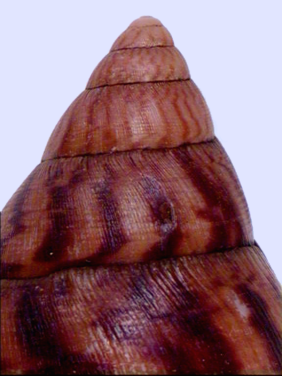
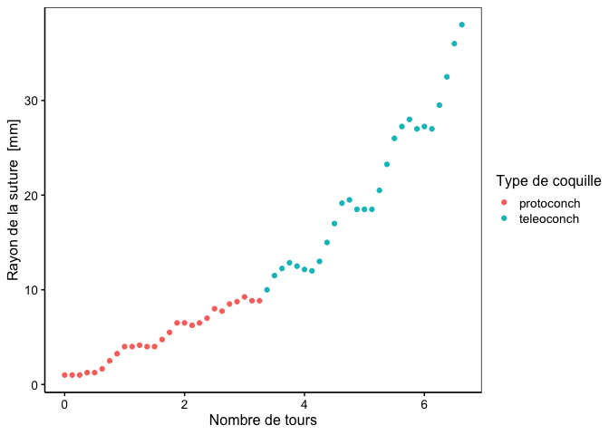

Croissance de la coquille d’escargots géants d’Afrique - analyse libre
================

# Avant-propos

Cette séance d’exercices est susceptible d’être mise à jour. N’hésitez
pas à vérifier le lien suivant afin de voir si des modifications ont été
apportées dans les consignes :
<https://github.com/BioDataScience-Course/B02Ib_achatina>

# Introduction

*Achatina achatina* (Linnaeus, 1758) a été étudié dans le cadre d’un
travail de modélisation de la croissance des coquilles d’escargots
gastéropodes.

Le jeu de données `achatina` comprend les variables suivantes :

-   `coils` : nombre de tours de coquille (sans unité)
-   `radius` : rayon de la suture mesuré depuis le point de référence
    (apex, sommet de la coquille) en vue apicale (“vue du haut”) en mm
-   `shell` : type de coquille juvénile (protoconche) ou adulte
    (téléoconche)

Nous pouvons visualiser ces données grâce au graphique ci-dessous.

<!-- -->

# Objectif

Utilisez les différentes notions que vous avez apprises sur la
régression linaire dans les modules 1 et 2 de votre cours pour modéliser
la croissance de la coquille de ces mollusques gastéropodes. N’hésitez
pas à diviser votre analyse en 2 parties si nécessaire (`protoconch`
*versus* `teleoconch`).

Ceci est un projet **individuel**, **court** et **libre** qui doit être
**terminé pour la fin du module 2**.

Structurez votre document `docs/achatina.Rmd` comme un rapport
scientifique avec les sections suivantes :

-   Introduction (sommaire en un paragraphe ou deux maximum)
-   But (quelle est la question posée ici ?)
-   Matériel et méthodes (protocole utilisé pour mesurer et analysé les
    données en un paragraphe ou deux)
-   Résultats (vos analyses avec commentaires succincts telles légendes
    des figures et tables et principales observations faites sur vos
    analyses)
-   Discussion et conclusion

**À la fin de votre étude, vérifiez que votre document
`docs/achatina.Rmd` compile en un fichier final HTML sans erreurs via la
bouton Knit.** Un rapport d’analyse contenant des erreurs ou autres
anomalies qui empêchent cette compilation n’est pas recevable !

# Note

Les données de ce projet ont été employées dans le cadre d’une
publication de Van Osselaer et Grosjean (2000). Elle est disponible dans
le dossier `bibliography`. Elle vous permettra de compléter les sections
introduction et matériel et méthodes grâce aux informations qui s’y
trouvent.

# Références

Van Osselaer, Christian, and Philippe Grosjean. 2000. “Suture and Location of the Coiling Axis in Gastropod
Shells.” *Paleobiology* 26 (2): 238–57.
<http://www.jstor.org/stable/2666014>.

