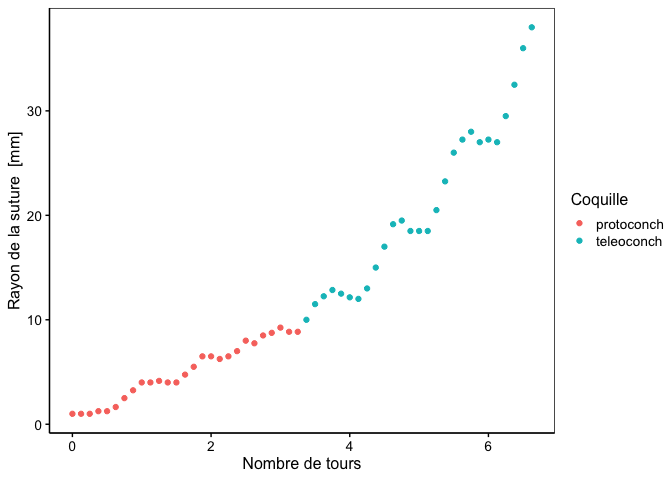

Croissance de la coquille de l’escargot géant d’Afrique
================

# Introduction

*Achatina achatina* (L., 1758) a été étudié dans le cadre d’un travail
de modélisation de la croissance des coquilles d’escargots gastéropodes.

Le jeu de données `achatina` contient les variables suivantes :

- `coils` : nombre de tours de coquille (sans unité)
- `radius` : rayon de la suture mesuré depuis le point de référence
  (apex, sommet de la coquille) en vue apicale (“vue du haut”) en mm
- `shell` : type de coquille juvénile (protoconche) ou adulte
  (téléoconche)

Nous pouvons visualiser ces données grâce au graphique ci-dessous.

<!-- -->

# Objectif

Ce projet est **individuel**, **court** et **cadré**. Son template se
trouve à <https://github.com/BioDataScience-Course/B02Ia_achatina>.

Votre objectif est de construire un modèle de croissance de la coquille
de ces mollusques. Utilisez les différentes notions que vous avez
apprises sur la régression linéaire dans les modules 1 et 2 du cours.

# Consignes

Complétez le document `achatina_notebook.qmd`.

Respectez la structure du document.

- Introduction
- But (quelle est la question posée ici ?)
- Matériel et méthodes (comment les mesures ont été faites)
- Analyses (vos analyses avec une description complètes)
- Discussion et conclusions

**À la fin de votre étude, vérifiez que votre document
`achatina_notebook.qmd` compile en un fichier final HTML sans erreurs
via le bouton Knit.** Vous avez une batterie de tests à votre
disposition ensuite pour vérifier que le travail est réalisé
correctement (onglet “Construire” -\> bouton “Construire tout”).
Vérifiez enfin que vous avez **enregistré vos modifications**, puis
faites un **commit**, un **pull** et un **push**. Vous pouvez
directement vérifier dans le dépôt GitHub qu’il présente votre travail
tel qu’il sera visible à la correction. **L’oubli d’un enregistrement
et/ou d’un commit ou d’un push peut faire qu’une partie de votre travail
ne sera pas pris en compte**, donc vérifiez plutôt deux fois qu’une.

Les deux documents Quarto (`achatina_notebook.qmd` et
`achatina_report.qmd`) comprennent une bibliographie. **Vérifiez que
vous comprenez bien comment l’utiliser dans un document Quarto en
regardant les balises employées en passant l’éditeur en mode “source”.**
Faites-en de même pour les labels, légendes et références croisées des
figures, tables et équations dans `achatina_report.qmd`. Voyez aussi la
façon d’inclure des informations supplémentaires sur les auteurs dans le
même document.

Les données de ce projet ont été employées dans le cadre d’une
publication de Van Osselaer et Grosjean (2000). Cette publication est
disponible dans le dossier `biblio`. Évitez cependant de perdre trop de
temps à lire la bibliographie et les formatages Markdown dans le cadre
de cet exercice (vous pourrez toujours y revenir plus tard). Nous vous
conseillons d’organiser votre temps comme suit :

- Prise de connaissance des consignes et lecture de l’abstract de la
  publication
- Bien comprendre la question posée en lisant attentivement
  l’introduction et le but du travail qui ont été rédigés pour vous.
- Réaliser l’analyse
- Interpréter les différents items de l’analyse
- Réserver suffisamment de temps pour écrire une discussion et des
  conclusions qui forment une partie importante de l’exercice
- Comparez le bloc-notes, le rapport et la publication scientifique et
  complétez la dernière partie de la discussion en fonction du temps
  restant

# Référence

Van Osselaer, Christian, and Philippe Grosjean. 2000.
“Suture and Location of the Coiling Axis in
Gastropod Shells.” *Paleobiology* 26 (2): 238–57.
<http://www.jstor.org/stable/2666014>.

